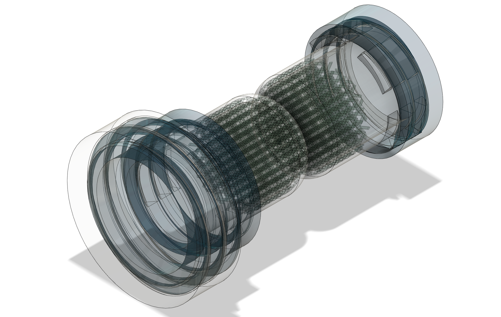

# CAD files repository from Lamun projects' (Laboratory of Microbiology, University of Neuchâtel, Switzerland)

Here you'll find 3D models of scientific devices developed by the laboratory and related to some of our publications and [collaborations](https://github.com/Bacterial-Fungal-Interactions-SFA). The rationale for creating this repository was that we had various issues while using third-party models, particularly with complex ones. As this domain is steadily developing in the laboratory, it will host more and more material with time. Check it out regularly! 

#### [Bacterial_bridge_Khun_2022.zip](Bacterial_bridge_Kuhn_2022.zip) contains the following: files

- **Fusion360 file:** Bridge_T_K_clean.f3d
- **STL file:** Bridge_T_K_clean.stl
- **Preform file:** Bridge_T_K_clean.form

*publication*: Kuhn T, Buffi M, Bindschedler S, Chain PS, Gonzalez D, Stanley CE, Wick LY, Junier P, Richter XL. Design and construction of 3D printed devices to investigate active and passive bacterial dispersal on hydrated surfaces. BMC Biol. 2022 Sep 14;20(1):203. doi: 10.1186/s12915-022-01406-z. PMID: 36104696; PMCID: PMC9476585.

#### [Bacterial_trail_Khun_2022.zip](bacterial_trail_Kuhn_2022.zip) contains the following files:

- **Fusion360 file:** bacterial_trail_Kuhn_2022.f3d
- **STL file:** bacterial_trail_Kuhn_2022.stl
- **Preform file:** bacterial_trail_Kuhn_2022.form

*publication*: Kuhn T, Buffi M, Bindschedler S, Chain PS, Gonzalez D, Stanley CE, Wick LY, Junier P, Richter XL. Design and construction of 3D printed devices to investigate active and passive bacterial dispersal on hydrated surfaces. BMC Biol. 2022 Sep 14;20(1):203. doi: 10.1186/s12915-022-01406-z. PMID: 36104696; PMCID: PMC9476585.

#### [Fungal_highway_column_V2_Junier_2021.zip](Fungal_highway_column_V2_Junier_2021.zip) contains the following files:

- **Fusion360 file:** Fungal_highway_column_V2_Junier_2021.f3d
- **STL file:** Fungal_highway_column_V2_Junier_2021_cap_side1.stl
                Fungal_highway_column_V2_Junier_2021_middle.stl
                Fungal_highway_column_V2_Junier_2021_main_frame.stl
                Fungal_highway_column_V2_Junier_2021_cap_side2.stl                
- **Preform file:** FHC_03_fev2025_clean.form

**NB**	<ins>this device is not the original, but an evolution to overcome SLA printing problems affecting screw threads. This model is more robust and functional.</ins>
 
*publication*: Junier P, Cailleau G, Palmieri I, Vallotton C, Trautschold OC, Junier T, Paul C, Bregnard D, Palmieri F, Estoppey A, Buffi M, Lohberger A, Robinson A, Kelliher JM, Davenport K, House GL, Morales D, Gallegos-Graves V, Dichosa AEK, Lupini S, Nguyen HN, Young JD, Rodrigues DF, Parra-Vasquez ANG, Bindschedler S, Chain PSG. Democratization of fungal highway columns as a tool to investigate bacteria associated with soil fungi. FEMS Microbiol Ecol. 2021 Feb 11;97(2):fiab003. doi: 10.1093/femsec/fiab003. PMID: 33440006; PMCID: PMC7878174.

